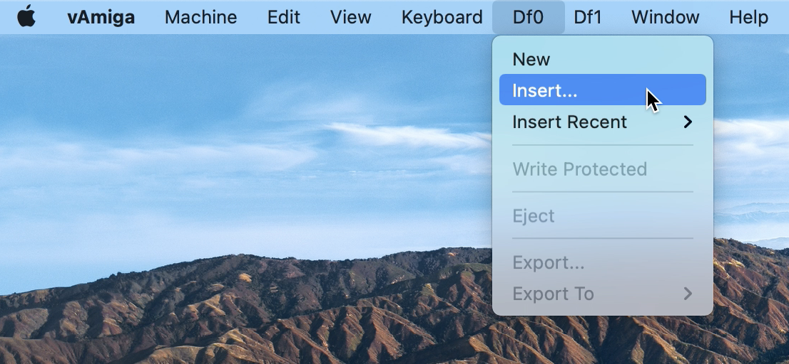
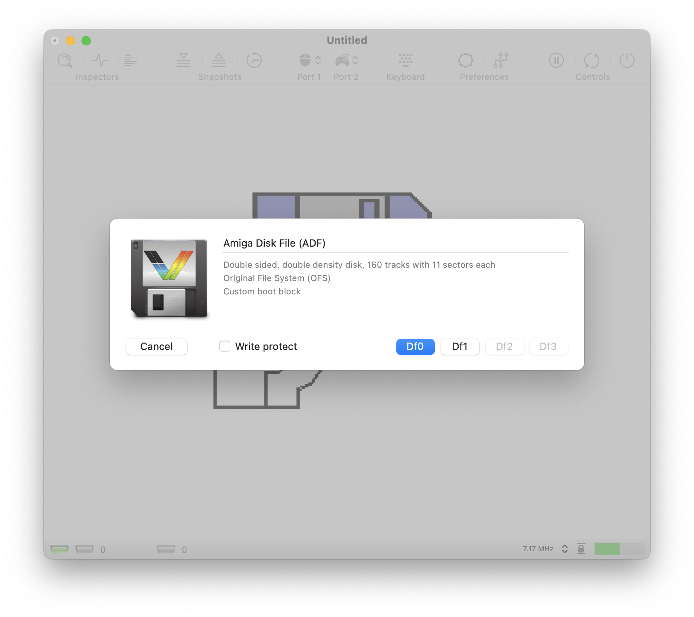

# Using Floppy Disks

Thanks to the diligent work of many Amiga enthusiasts, almost all Amiga software from back in the day has been saved from decay and translated into modern data formats. The most important data format for the Amiga is the ADF format, which is a digital image of an Amiga floppy disk. On the Internet you will find countless ADFs and most likely your beloved titles from back then, too. Please note that despite their age, most Amiga titles are protected by copyright and may not be used without the permission of the rights holders.

## Inserting a disk

If you possess an ADF file legally, you can insert it into one of the connected disk drives in several ways:
							
- Inserting a floopy disk via the drive menu

    The menu bar contains a separate menu for each connected drive. In order to insert an ADF, e.g., into the internal drive, select the Insert option in the Df0 menu. The	menu offers additional options. For example, it is possible to activate the write protection, eject the currently inserted disk, or create a new, empty floppy disk.

    

- Inserting a floppy disk via drag and drop

    The easiest and quickest way to insert a floppy disk is per drag and drop. When an ADF file is dragged into the emulator window, four drop boxes will appear representing drives Df0 through Df3. Simply drop the file onto the drive in which you want to insert the disk.

    

	When a file is released outside the drop boxes, a mount dialog opens that provides more detailed information about the disk to insert.

    

## Disk Formats

Besides the ADF format, vAmiga supports the following floppy disk file types:

### DMS Format

DMS files store a digital image of an Amiga floppy disk, just like ADFs. However, the internal representation is much more complicated. The format is very popular in the demo scene. Thus, you will find many demos encoded in this format.

### EXE Format
	
vAmiga also supports pure Amiga executables. When such a file is passed to the emulator, vAmiga creates a floppy disk on-the-fly and copies the executable to it. It also makes the floppy bootable by adding a boot block and a startup sequence that loads the executable.

### IMG Format

Image files are floppy disks in MS-DOS format. Inserting such a floppy disk makes sense only if you use special software that can read such floppy disks.
