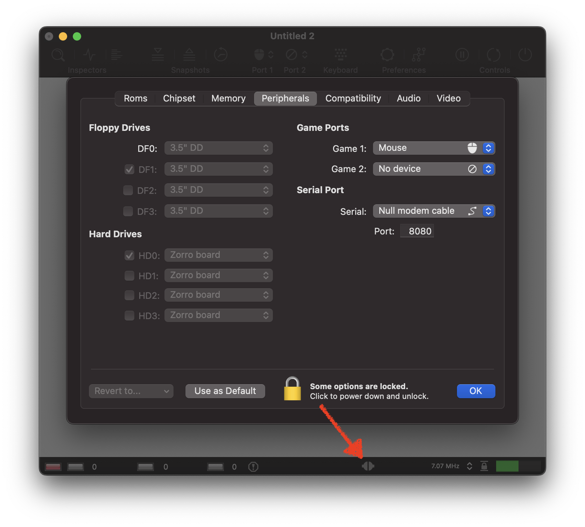
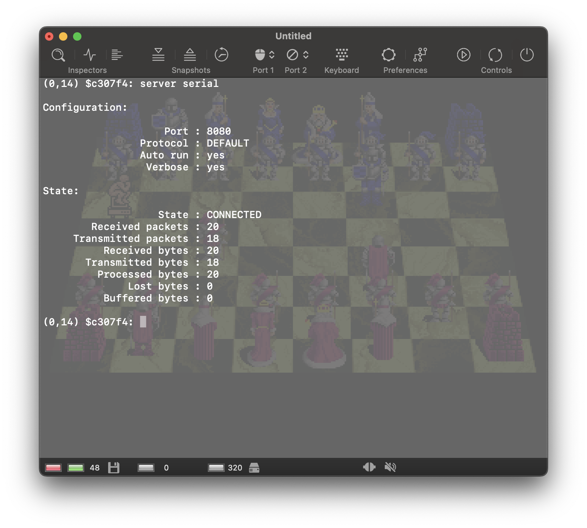

# Connecting Two Amigas

vAmiga supports two emulator instances to be connected with a null model cable, allowing the user to run multiplayer games. In this article we will walk through the necessary steps to connect two emulator instances running Battle Chess.

First of all, launch vAmiga, open the configuration window and switch to the Peripherals tab. In this tab you can configure the serial interface:

Now open the serial port popup menu and select *Null Model Cable* from the options list. This will connect one side of a null modem cable to the serial port of your virtual Amiga. Internally, the null modem cable is emulated using socket connections, which means that the connected Amigas must agree on a common port number to communicate. By default, vAmiga uses port  8080, but you can choose a different port if you like.

As you can see in the screenshot above, a small icon has appeared in the status bar. This indicates that the socket server has been activated and is waiting for another emulator instance to connect.

Now launch another instance of vAmiga and connect the null modem cable the same way.

After the null modem cable has been selected in the second emulator instance, the status icon has changed its shape, indicating that the connection has been established. If the icon looks different on your computer, please check if both emulator instances are listening to the same socket port.

Now it's time to load Battle Chess on both Amigas. The configuration of the null model cable is quite simple in this game: The the *Settings* menu let's you select the player type for each side of the board. 

This is how I configured the first emulator instance. The Amiga controls the blue army, the connected computer controls the red army.

The second emulator instance is configured the other way around. The Amiga controls the red soldiers, the connected computer controls the blue ones. After selecting *New Game* from the menu in either emulator instance, it's time to chill. Have fun with two vAmigas fighting each other.

## Troubleshooting

If everything works as expected, the socket connection should be established exactly as described above. If vAmiga refuses to connect, you can display some additional debug information in RetroShell. To do so, open RetroShell by pressing on the corresponding toolbar icon. Inside RetroShell, switch to the *Debugger* by pressing the *Shift + Return*. Now, type `server serial` as shown in the screenshot below. This command displays the current connection status and outputs some statistical information about the transferred data.

