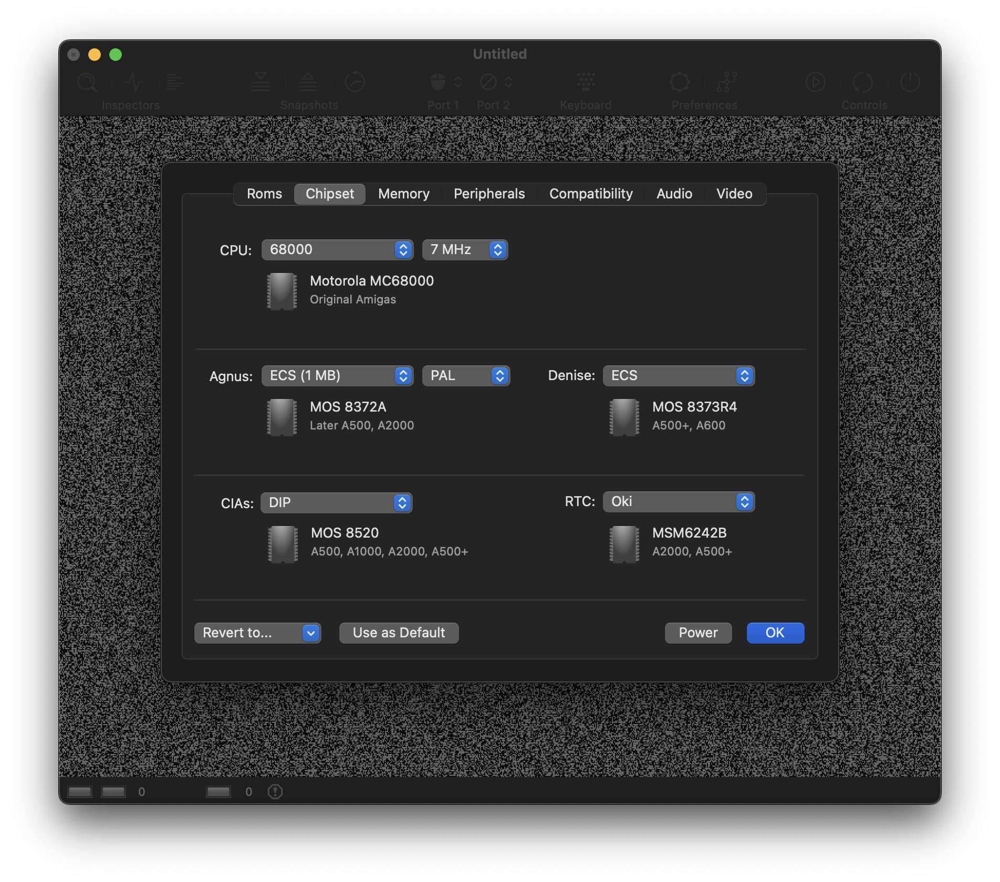

# Chipset Panel

Use this panel to configure the CPU and the custom chips of the virtual Amiga.

## CPU

vAmiga supports three different CPU revisions:

- **M68000**

  The M68000 is a 16/32-bit CISC microprocessor which was introduced by Motorola in 1979. Commodore has used this CPU in all classical Amiga models. Choose this revision, if you wish to emulate the classic Amigas with highest precision. 

- **M68010**

  The MC68010 processor was released in 1982 as the successor to the Motorola 68000. It was never used officially by Commodore in any Amiga model. However, because the M68010 is pin-compatible to the M68000, it could be used as a drop-in relacement for the M68000 in all classic Amiga models. Using the M68010 instead of the M68000 usually resulted in a speed gain of approx. 10%. A major source for this speed-up was a special operation mode called *loop mode*. The CPU entered this mode automatically when certain loop constructions were used and was able to process these loop much faster than the M68000. Please keep in mind that the M68010 is not 100% software compatible to the M68000. Hence, some titles might refuse to work if this CPU is selected. 

- **68EC020**

  The M68EC020 is a lower-cost version of the Motorola 68020 processor which was released in 1984. It was used by Commodore in the Amiga 1200 with a clock frequency of 14MHz. The 68020 is a major improvement over the M68010 since it was the first CPU in the M68k series that featured on-board caches. vAmiga is emulate the M68EC020, but at a lower precision-level compared to the M68000 and M68010. For the first two models, vAmiga is capable of performing cycle-exact emulation which means that all instructions consume the exakt amout of CPU cycles and every memory access is performed during the exact same DMA cycle as it is performed on the real-machine. In 68020 mode, the CPU is emulated with much less accuracy. E.g., caching is not emulated at all. 

The next two options select the emulated chip revisions of Agnus and Denise which are two of the so called *custom chips* of the Amiga. These chips were extremely important for the Amiga because a big portion of it's computing power come from those chips. Without them, the Amiga would never have taken the prominent place in computer history it occupies today.

All custom chips can be classified into one of three chip generations. The first generation is called OCS (Original Chip Set). All orginal Amiga were equipped with those chips. The second generation is called ECS (Enhanced Chip Set). Both the OCS and ECS chipset is supported by vAmiga. The third generation of custom chips was labelled AGA for Advanced Graphics Architecture. Commodore equipped the A1200 and A4000 with those chips. The AGA chipset is *not* supported by vAmiga at the moment and will probably never be.

## Agnus

Agnus is undoubtedly the most significant among these chip because it controls the interaction of all other components. I.e., every DMA access is done by this chip.

Over time, Commodore has developed several revision of this chip. vAmiga offers the following configuration options for this chip:

- **Early OCS**

  This option emulates the MOS8367. It was used in the A1000 and in a very early revision of the A2000 which is sually refered to as the A2000A.

- **OCS** 

  This option emulates the MOS8371. This chip was used in many revision of the A500 and A2000. It is the most commonly used OCS version of this chip.

- **ECS (1MB)**
    
  This option emulates the MOS8372A. It is the first ECS revision of this chip and was used in later revisions of the A500 and the A2000. Apart from several minor details, the ECS variant mainly differs in the size of the addressable memory. While the OCS models can address 512 KB of chip RAM, only, the ECS version was able to address twice as much. 

- **ECS (2MB)**

  This option emulates the MOS 8375. It bumped up the range of addressable Chip Ram to 2 MB and was used in the Amiga 500+ and the Amiga 600 which were released in 1991 and 1992, respectively.

## Denise 

- **OCS**

This option selects the MOS 8362R8 which was used in all revisions of the Amiga 1000, Amiga 500 and Amiga 2000. 

- **ECS**

This option selects the MOS 8373R4. The chip is sometimes refered to as *HiRes Denise* and was used in the Amiga 500+ and the Amiga 3000. Compared to it's predecessor, it supported additional graphics modes and featured a more advanced sprite unit. It also had a feature called *Border Blank* which causes the border to be drawn in black instead of the current background color. Some games use this functionality to surround the drawing area with a nicer looking frame. 

## CIAs

The Amiga utilises CIAs of type MOS 8520 to interact with peripheral devices. These chip are similar to the well-known MOS 6526 chips which were used in the C64. There are subtle differences, though. For example, Commodore has replaced the TOD clock with a native 24-bit counter and implemented an autostart mechanism for the CIA timers. 

vAmiga supports emulation of two MOS 8520 models:

- **DIP**

  This options selects the DIP version of the MOS 8520 complex interface adapter (CIA). The DIP models are the default option since they were used in all classic Amigas. 

- **PLCC** 

  This options selects the PLCC version of the MOS 8520. The PLCC version was used, e.g., in the Amiga 600. 

## RTC

RTC refers to the real-time clock of the Amiga. The first Amiga, the Amiga 1000, never shipped with a real-time clock and it was pretty cumbersome to add such a device. For the Amiga 500, adding an RTC was easy as many trapdoor memory expansion cards had such a device on board. They can be easily recognized by the battery, which is required to keep the register contents alive. In the Amiga 2000, the real-time clock was soldered directly onto the motherboard. In hindsight, this was a bad idea, since the battery, which was also soldered directly onto the motherboard, is the number one death bringer of such machines today. Many of us lost the beloved machines due to leaking battery.

vAmiga offers the following configuration options:

- **None**

If this option is selected, no real-time clock will be emulated.

- **Oki**

This options emulates a real-time clock of type MSM6242B manufactured by Oki Semiconductor. Commodore used this chip in the A2000 and the A500+.

- **Ricoh**

This option emulates a real-time clock of type RF5C01A menufactured by Ricoh, Ltd. Commodore used this chip in the A3000 and the A4000. 
