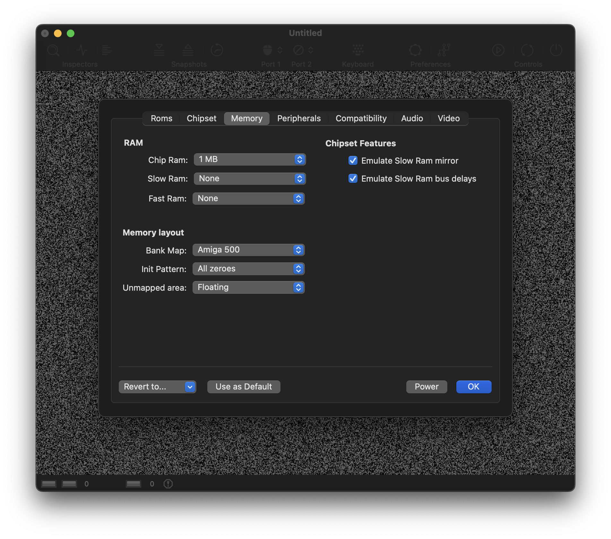

# Memory Panel

Use this panel to configure the amount a Ram and basic memory properties. 

## Ram

The Amiga distinguishes three types of random access memory: 

- **Chip Ram**

  Chip Ram refers to the factory-installed memory which is located on the motherboard. It is the most flexible Ram because it can be accessed by both the CPU and the custom chips. The Amiga 1000 had a limited amount of 256 KB on board which could be expanded by a 256 KB Ram expansion module which was plugged into an expansion slot on the front side of the chassis. The later released Amiga 500 shipped with 512 KB right from factory. The Amiga 2000 was released in different version over time. The original Amiga 2000 shipped with 512 KB just as the Amiga 500. Later versions had 1 MB on board.

- **Slow Ram** 

  The Amiga supported two types of Ram expansions. The first type is *Slow Ram* which is also called *Ranger Ram*. In the case of the Amiga 500, Slow Ram was added by inserting a memory expansion card into the trapdoor slot on the bottom of the computer case.  
  
  Slow Ram has a somewhat bad reputation, because it combines the disadvantages from two world. First, it cannot be accessed by the custom chips which means that it can't hold any data which is processed directly by the custom chips. Second, it shares the same memory bus than Chip Ram. That means that no Slow Ram access can happen during DMA cycles, although the Ram itself is not accessible via DMA.

- **Fast Ram** 

  Fast Ram is the second type of Ram expansion. This kind of Ram is directly connected to the CPU. As a result, it is not accessible by the custom chips, just as Slow Ram isn't. However, because the Ram is connected directly to the CPU, the CPU can access this type of memory in parallel to DMA activity. This is the reson why this kind of memory is called Fast Ram. The memory access itself is not accelerated compared to Chip Ram or Slow Ram. he default setting is 0 KB, because some Amiga programs fail to work if Fast Ram is present.

Because 512 KB of Chip Ram was very little to work with, and Fast Ram was very expensive, 512 KB Chip Ram, 512 KB Slow Ram, and no Fast Ram was a common memory configuration back in the day.

## Memory layout

- **Bank map**

  The original Amiga use a 24-bit addres bus which means they are capable of addressing 16 MB of memory. We can think of this memory being split chunks of 64 KB which we refer to as memory banks. The bank map determines the memory area where specific components are mapped in or mirrored to. E.g., Chip Ram always starts at address $000000 whereas Slow Ram is usually starts at address $C00000. Mirroring means that we can access one and the same target, e.g. a custom chip register, through several different addresses. A programmer could therefore just as well use an address from the mirrored area instead of the officially documented one, and many programmers did. Unfortunately, the mirrored areas are not the same in all Amiga models. This means that we are confronted with a number of different memory layouts, and we need to tell the emulator which memory layout to use.

  vAmiga supports four bank mapping schemes: A500, A1000, A2000A, and A2000B. The bank maps mainly differ in the memory location where the real-time clocks is mapped in. In the first Amigas, namely the A1000 and the A2000A, the real-time clock appeared in memory bank D8. In the A500 and the most common A2000 model, the A2000B, commodore let the real-time clock appear in memory bank DC. 
  
  Other differences affect mirror banks. E.g., the official location of the custom registers is memory bank DF. However, this bank is usually mirrored several times, which means the same custom registers are also accesible by using different memory addresses. E.g., on older Amigas, the custom register area was mirrored in bank DC, the bank where later Amiga mapped in real-time clock.

- **Init Pattern**

  The init pattern determines how memory should be initialised on startup. You may choose between random values, all zeroes, or all ones.
 
- **Unmapped area**

  This option tells vAmiga which values should be put on the data bus if an unmapped memory location is accessed. Besides telling vAmiga to leave the data bus in a floating state, you may choose to return all zeroes or all ones in this case. The first option comes close to what happens in a real Amiga, but the current implementation is not 100% accurate. Any advice on improving the emulation of floating data bus lines is highly appreciated. 

## Chipset features

- **Emulate Slow Ram Mirror** 

  The ECS variants of Agnus have an interesting ability that is not offered by the OCS variant. If an ECS Agnus is connected to 512 KB Chip RAM and 512 KB Slow RAM, it mirrors the Slow RAM into the second Chip Ram segment which makes Slow Ram accessible for DMA. Mirroring Slow RAM into the lower memory regions enables the Blitter and the Copper to fully access both RAMs, now. 

  This option has no effect, if an OCS Agnus is emulated or if the selected memory configuration does not match the 512 KB Chip Ram + 512 Slow Ram configuration.   

  A demo that relies this feature is *Move Any Mountain* by Lazy Bones. It was presented 1993 at the POLARIS Computer Party. It won't run when this options is disabled or if an OCS Agnus chip is selected. 

- **Emulate Slow Ram Bus delays**

  As stated above, the CPU requires a free DMA cycle to access Slow Ram. By default, vAmiga emulates this behaviour. Disabling this option removes this restriction, allowing the CPU to access Slow Ram at the same speed as Fast Ram. Please keep in mind that accelerating Slow Ram accesses always come with the risk of creating incompatibility issues in rare situations.
