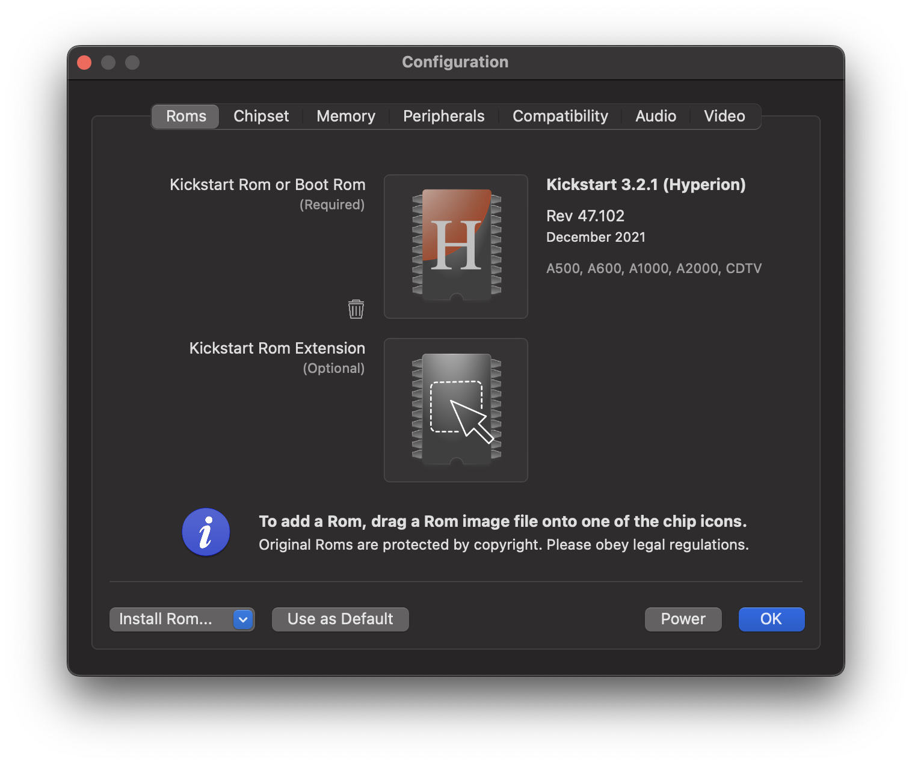

# Rom Panel

Use this panel to add Rom images to the emulator. 

When vAmiga is started for the first time, you will be taken directly to this panel. This is the place where you will manage an essential part of your virtual Amiga: The Kickstart Rom. 

## Kickstart Rom

Rom images are added via drag and drop. To install a Kickstart Rom, simply drop a Rom image into the upper drop zone. Immediately after the image has been dropped, vAmiga performs a two-stage check. In the first stage, the file size and the values of some magic bytes are verified. If the file size does not match or the magic byte sequence is unknown to the emulator, the Rom image is rejected. Otherwise, the emulator continues by comparing the CRC checksum of the Rom image with the entries of a small database. When the CRC checksum was found, the name of the Rom is displayed along with some other information such as the release date. In the screenshot above you can see that vAmiga has recognized the dragged-in file as an original Commodore Kickstart Rom 1.3. If the CRC checksum is unknown to the emulator, vAmiga classifies the Rom as *Unknown*. You can still start the emulator with it, but there is no guarantee that the emulator will work as expected. 

Please note that vAmiga does not ship with any of the original Commodore Roms. All Amiga Roms are the intellectual property Cloanto™ and distributed for a fee. However, if you have purchased a Kickstart Rom legally, you can use it in vAmiga with no issues.

If you don't have an original Kickstart at hand, you may choose to install the Aros replacement Rom. The replacement Rom is an open-source Kickstart variant which is freely redistributable. Two revisions of the Aros Rom are shipped with the emulator, which can be installed using the dropdown menu in the lower left corner. Unfortunately, not all Amiga programs are compatible with Aros, which is why we strongly recommend buying original Roms.

## Extension Rom

In case you decide to resort to the Aros Kickstart replacement, you will notice that there will be two Roms installed in your virtual Amiga. This is due to the size of the Aros Rom, which significantly exceeds the original Kickstart size of 512 KB. For this reason, Aros has been split into two separate Roms. The first one appears in the same memory range as the original Kickstart, the second one appears in the address range $E00000 - $E7FFFF. 

Rom extensions can also be installed manually by dropping a Rom image into the lower drop zone. Unlike the Kickstart Rom, which always resides in the same address range, the expansion Rom can be mapped to different memory areas. As mentioned above, the Aros expansion Rom must be visible to $E0000 to function. Other expansion Roms, however, are expected to be visible in the $F00000 - $F7FFFF address range. You can set the address range manually by selecting the memory range from the popup menu next to the expansion Rom.
