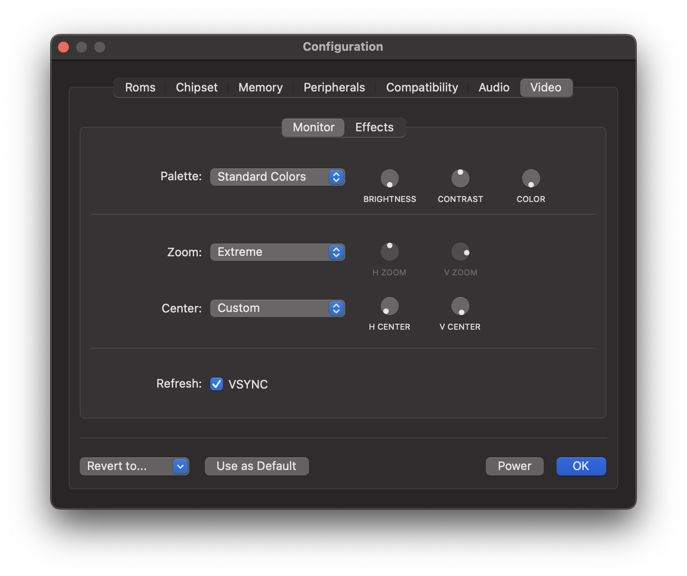

# Video Panel

Use this panel to change video settings. The Video panel is divided into two sub-panels: The *Screen panel* and the *Effects panel*. In the first one we can control basic image properties, the visible screen area and sync mode. The second panel allows us to fine-tune the shader pipeline. It allows us to configure various effects that try to mimic the look and feel of CRT screens from back in the day.

## Monitor 

  

### Palette

  This option is used to select the monitor type. Besides emulating a color monitor, which is the default option, different types of monochrome monitors can be emulated, such as amber or green monitors. As with a real monitor from back in the day, you can set three parameters that affect the color palette: *brightness*, *contrast*, and *color*.

  The following screenshot shows how vAmiga looks on a monochrome monitor with a sepia color: 

  

 ### Zoom

The zoom level defines the visible screen area and can be changed manually for the horizontal and vertical axis. The drop-down menu provides some predefined values from which you can choose.

 ### Center

While the zoom level defines the dimensions of the visible screen area, the two centering parameters determine the position of the center point. Please note that changing these parameters has no effect if the zoom level is zero. In this case, the visible screen area corresponds to the entire texture, which makes it impossible to move the center point.
    
 ### Refresh

vAmiga supports two methods for synchronizing the emulator thread. The default method is based on timers. In this mode the emulator puts itself to sleep after a single frame has been computed. When the thread wakes up, the next frame is computed and so on. This method is the most flexible, as it supports arbitrary frame rates. I.e. vAmiga computes 50 frames per second in PAL mode and 60 frames per second in NTSC mode. However, there is a problem associated with this method. Since the emulator thread is not synchronized with the graphics loop, it may happen that some frames are either dropped or displayed twice.
    
  In video games, a common workaround is to have the graphics loop trigger the image calculation. This method is usually called VSYNC because the image provider and the graphics loop no longer work independently. When VSYNC is enabled in vAmiga, something similar happens. The emulator thread no longer sets a timer to wake up the emulator thread. Instead, it waits for a wake-up signal from the graphics backend. The result is that the number of images requested exactly matches the number of images drawn. However, this method has its pitfalls, too. Since a modern TFT display normally updates at 60Hz, vAmiga is asked to calculate 60 frames per second. This is fine for NTSC, but not for PAL. If a PAL machine is emulated in this mode, it will run slightly faster than the original machine. 

  However, with modern Macs, this problem is easily solved. With the introduction of ProMotion technology, Macs can be configured to operate at user-defined refresh rates. On such machines, the default refresh rate can be lowered to 50 Hz in the system settings. As a result, the Amiga runs at its original speed again. 

  

## Effects

  vAmiga utilizes a sophisticated graphics pipeline that allows the emulator texture to be manipulated in various ways. 

  

### Upscaling

  The GPU pipeline of vAmiga includes two pixel upscaling stages. In the first stage, in-texture upscaling is performed to all lores lines. In this stage, the texture size remains unchanged. The second stage is a more traditional upscaling stage where the texture size is doubled. The selected upscaling algorithm is applied to both lores and hires pixels. 
  
  For each stage, the upscaling algorithm can be selected independently. Currently vAmiga supports the EPX and xBR upscaling algorithms. If upscaling is not desired, one or both stages can be disabled. 

  
  

### Scanlines

Three scanline modes are supported: *None*, *Embedded* and *Superimposed*. 

- **Embedded Scanline Mode** 

  In this mode, scanlines are emulated by darkening every other scanline of the emulator texture. This method has the disadvantage of creating Moiré patterns. To avoid these patterns, the height of the emulator window must be adjusted so that each line of the emulator texture maps to a unique line on the native screen. vAmiga can set the correct height for you. All you need to do is to select the *Adjust* menu item in the *Window* menu. 

- **Superimposed Scanline Mode** 

  In this mode, scanlines are generated by the fragment shader. The fragment shader is applied very late in the graphics pipeline and already working on the final texture. As a result, Moiré effects are no longer possible. A disadvantage of this method is that the dimensions of the scanlines are now independent of the height of the emulator window. This means that the number of displayed scanlines does no longer match the number of scanline we would see on a real CRT monitor.

  
  

  ### Dot Mask

  vAmiga can emulate various dot mask patterns to imitate the small red, green and blue dots used by a real CRT monitor to compose the image.

  
  

  ### Flicker

  PAL or NTSC screens are designed to transmit the image in the form of 50 or 60 fields per second. A picture consists of two fields, one containing all even lines and the other containing all odd lines. This results in an output rate of 25 frames for PAL and 30 frames for NTSC. In the default display modes, the Amiga uses the same pixel information for both fields, resulting in a stable picture at 50 or 60 Hz. However, the Amiga had the ability to double the vertical resolution by using different images for both fields. These modes are called interlace modes. Since both images only repeat 25 or 30 times per second, the image flickers for the human eye. vAmiga is able to emulate flickering in different intensities. 

  Back in the day, *Flicker Fixer* was a popular, albeit expensive, product. By buffering the video image, it managed to produce a smooth picture at twice the vertical resolution. To mimic what Flicker Fixer did back then, simply disable flicker emulation in vAmiga. 
  
### Blur

  When this option is enabled, vAmiga adds another stage to the graphics pipeline that applies a Gaussian blur filter to the upscaled image.

  
  

### Bloom

  When a bright object is displayed on a dark background, the white light spreads out a bit when displayed on a CRT monitor. As a result, the object looks as if it was slightly glowing. This effect is called *blooming*. By activating this option, vAmiga will try to reproduce this effect. 

  
  

### Rays

  A CRT tube uses three separate electron beams, one for each color channel. Each beam produces a seperate image on the phosphor layer. When the electron beams are aligned, the color layers appear to be stacked precisely on top of each other and produce a crisp image. If the electron beams get disaligned, color artifacts occur because the three color layers are now shifted against each other. vAmiga can emulate this effect with varying intensity. 

  
  
