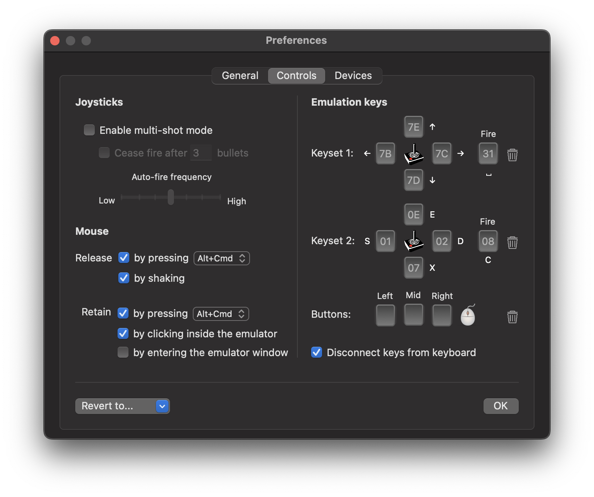

# Controls Panel

Use this panel to configure the mouse, joysticks, and the joystick emulation keys.

## Mouse

vAmiga supports multiple ways to release and retain the mouse pointer. The traditional way to release the mouse pointer is by using a special key combination. Since different emulators use different key combinations for this purpose, vAmiga allows the user to choose among *Alt+Cmd* and *Alt-Ctrl*. The most convenient method for releasing the mouse is by activating the shake detector. If active, simply perform some rapid mouse movements to the left and right to release the mouse pointer. 

vAmiga also offers several options for retaining the mouse. Besides using a special combination, the emulator can be configured to retain the mouse by clicking inside the emulator window or by simply moving the mouse pointer inside. 

## Joysticks

vAmiga offers a built-in multi-shot mode. In addition to ajusting the fire frequency, you may choose to fire constantly or in volleys with a customizabel number of bullets per volley. 

## Emulation keys 

As an alternative to a real joystick, you can use the emulator with a key-emulated device. vAmiga allows you to pre-define two keysets. In addition, you may also emulate the mouse buttons with a key. This is a handy option for the right or middle mouse button which does not physically exist on most Apple mice.  
