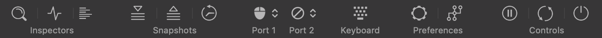
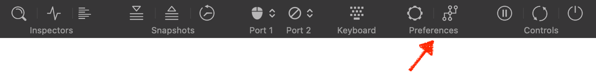
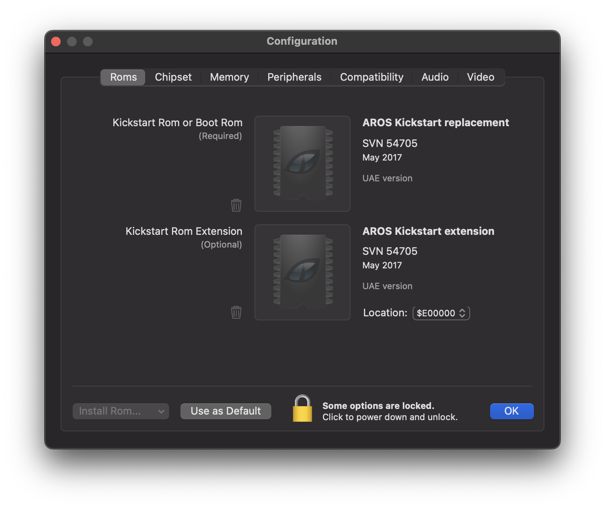

# Exploring the User Interface

In this tutorial, we'll explore the most frequently used elements of vAmiga's user interface.
## Toolbar

Many of the basic emulator properties can be controlled via the toolbar which has the following default appearance:

We'll walk through the toolbar items step by step.

### Controls

The three buttons in the *Controls* section let us control the emulator state:

The functionality of these button is what you might have guessed already:
- The left button pauses or resumes emulation. 
- The middle button performs a hard reset. 
- The right button switches the Amiga on or off.

### Preferences

The two buttons in the *Preferences* section let us configure vAmiga. The left button opens the Preferences window which comprises all settings belonging to the application level and are grouped in tabs. All settings are shared among all emulator instances. 

All available options are described in a seperate document. For the sake of this tutorial, we don't need to change anything here and can proceed immediately to the next item. 

The right button opens the Configurator window which let's us configure the virtual machine. The options are organized in tabs, similar to what we've seen in the preferences panel. You're familar with the first tab already if you have read the *Getting Started* tutorial. It let's us configure the Rom of the virtual Amiga. 

As for the preferences settings, you'll find a description of all available options in a seperate document. Please note that all settings made in the Configurator are specific to an individual emulator instance. Hence, it's possible to run two emulator instances side by side with different configurations.

### Keyboard

Although the Amiga is quite an aged computer by now, it already utilized a keyboard whose layout was quite similar to the ones used today. Therefore, in vAmiga you will be using the native Mac keyboard for typing, and for most Amiga keys you will find a perfect match on your native keyboard. However, there are exceptions. For example, the Amiga is equipped with a special help key that has no direct counterpart on the Mac keyboard. Also, some Mac keys are directly linked to operating system actions, which affects emulation. The most prominent examples are the two Command keys that are used to trigger operating system actions.

In cases where you need to press a key that is not directly accessible from your native keyboard. By clicking on the corresponding toolbar icon, the virtual keyboard opens as a sheet on top of the emulator window:

To operate a key, use either the left or right mouse button:
- Using the left mouse button presses the selected key and releases it soon afterwards. Use this option if you wish to press a single key.
- Using the right mouse holds down a key or releases it if it had been pushed down before. Use this option if you wish to press certain keycombination such as the reset combination *Ctrl+Amiga+Amiga* as shown in the screenshot. 

Once a key is pressed with the left mouse button, the virtual keyboard vanished automatically. It is also possible to open the virtual keyboard a seperate window than can stay open permanently next to your emulator window. To do so, press *Cmd-K* which is the key equivalent for the *Show...* item in the *Keyboard* menu. 

### Game Ports

The two gameport icons allow us to quickly switch between input devices that are connected to the virtual Amiga's game ports.

All available devices are presented in a popup menu: 

The mouse refers to the Mac's internal mouse. Note that the Mac does not distinguish between the mouse and the touch pad. This means that both devices cannot be used independently from each other. The next two item refer to keyboard emulated joysticks. vAmiga distinguishes between two keyset that can be customized in the Preferences.
The last two items are placeholder items that are currently greyed out. Once a compatible game pad is attached to the host such as a compatible USB joystick, the new device will show up under of the two items.

### Snapshots

The three toolbar icons in this section can be used to manage snapshots. Snapshots are frozen emulator states can restored at a later point in time. 

- The left button takes a snapshot and puts it into the snapshot storage.
- The middle button reverts to the emulator state recorded in the most recent snapshot. 
- The right button opens the snapshot browser.

  

  The snapshot browser is for vAmiga what *Time Machine* is for the Mac. It lets us browse through the snapshot storage restore any of the saved states as we like.

  Please keep in mind that snapshots are not stored permanently. The next time you start vAmiga, you'll start over with an empty snapshot storage. This is because Snapshot were originally designed as a safe-point mechanism for mastering difficult passages in a game. Snapshots were never meant for long-time preservation of emulator states, and they will never be, although many users would like to use them this way. The reason for this is that the snaphshot does not only contain Amiga specific data such as the memory contents or the values of the CPU register. It also contains the values of many emulator specific variables that have no direct couterpart on the real machine. Since the set of internal variables usually changes from release to release, the snapshot format changes, too. Hence, you can be almost certain that snapshots taken with the current version vAmiga will refuse to work in the next. 

### Inspectors

A major design goal of vAmiga was to make the emulated Amiga as transparent as possible. To reach this goal, vAmiga offers a variety of tools that let the user peek into the internal workings of the Amiga. The toolbar's *Inspectors* section grants access to these tools.

#### Inspector Panel 

The inspector is the primary place to retrieve information about the current state of the emulator. The inspector offers multiple tabs where the current state of different components can be view. The first panel is the CPU panel which looks like this: 

The panel shows the currently executed program as well as the contents of all CPU registers. The CPU panel is also the gateway to the CPU debugger. After pausing emulation, we can utilize the CPU panel to single-step through the currently executed instruction stream or to set breakpoints and watchpoints. 

#### Monitor Panel

The monitor panel offers additional debugging aids:

In the left column, we find the control elements for the DMA debugger which can be used to visualize all memory bus accesses in real-time. When enabled, the emulator texture is superimposed by an extra graphics layer that visualizes the bus owner for Chip or Slow Ram accesses. The following screenshot shows a scene from Rink a Dink with the DMA debugger enabled.  

The yellow and brown dots represent Copper and Blitter accesses, respectively. The red dots mark the memory refresh cycles and the pink dots mark the DMA slots for transfering audio data. Bitplane DMA is visualized in cyan. The scene reveals a lot about the making of this demo. The demo makers use a very small bitplane window that just covers the polygon. This window is then shifted around as the polygon moves. [This little Youtube video](https://www.youtube.com/watch?v=aDFVwy4gTaE) shows how *Rink a Dink* looks like when run in vAmiga with the DMA debugger enabled. If you don't want to watch the entire video, you may want to fast forward to 1:20. This is where the animated polygon can be seen in action.

The middle section of the monitor panel controls the so called *activity monitors*. When enabled, the emulator texture is overlayed with little monitors giving insight into the activity of different Amiga components:

#### Retro Shell

The third button in the *Inspectors* section opens *Retro Shell* which is vAmiga's text-based debug console. Using the shell, vAmiga can be controlled via a variety of text commands.

As a normal user, you will most likely never need to use the shell as most of the emulators functionality is accessible via the GUI. Retro Shell is also able to process script files. This functionality is utilized extensively by vAmiga's test suite (vAmigaTS) to perform automatic regression testing. 
