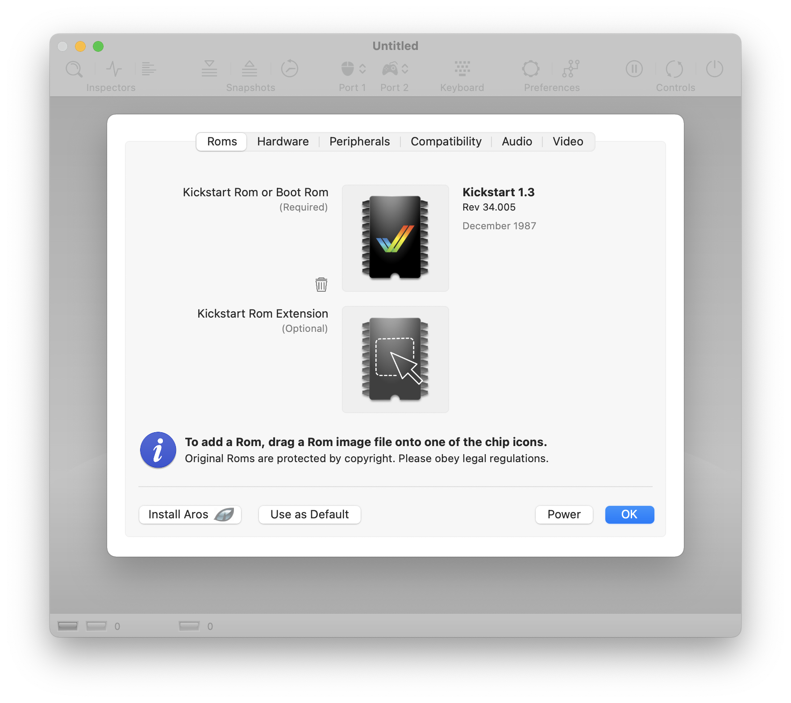
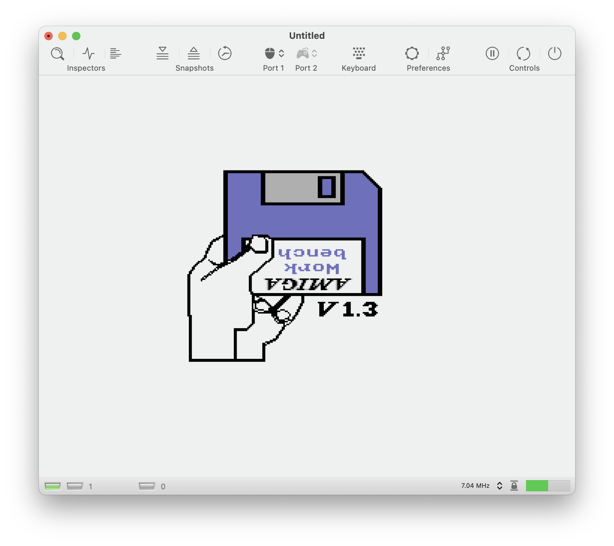

# Getting Started 

## Installing vAmiga

Amiga is a native Mac application and as easy to install as most other Mac applications. Download the latest version from the main page and copy the executable into the application folder. 

vAmiga’s deployment target is macOS 10.15 (Catalina) which means that you can’t run the app on earlier macOS releases. Please note that vAmiga is only extensively tested with the latest macOS version. Thus, compatibility problems may well occur with older macOS versions. 

Please keep in mind that vAmiga has been developed with limited work-power and we have ressources for supporting older macOS releases. You can always extract older version from the source-code repository, but you will be on your own by doing so. 

## Installing a Kickstart Rom

Emulating an Amiga requires a Kickstart Rom. Since the original Amiga Roms are the intellectual property of Cloanto™, they cannot ship with the emulator. Thus, when opening vAmiga for the first time, the emulator will greet you with a Rom dialog:

In this dialog, a Kickstart Rom can be added via drag and drop. If you are the legal owner of a Cloanto™ rom, you can easily install it by dragging it over the Rom icon:

Once the Rom is installed, the emulator is ready to be powered on. To do so, click the power button and have fun with your new old Amiga:

In case you don't own a legal rom, you can alternatively start vAmiga with the free Aros Kickstart replacement. Aros Roms ship with the emulator and can be installed easily by clicking the **Install Aros** button:

Again, clicking the power button starts the emulator. With the free Kickstart Rom replacement installed, the Aros boot screen shows up:

Even though the Aros Roms are a great achievement of the open source community, we recommend installing original Commodore Roms as they offer much higher compatibility.

Please keep in mind that vAmiga will not remember the Rom settings by default, i.e., the next time the emulator is startet, the Rom dialog will appear again. If you wish to use the currently installed Rom permanently, click the **Use as Default** button next to the Aros button.
